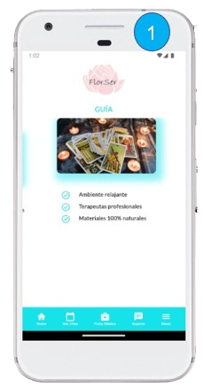
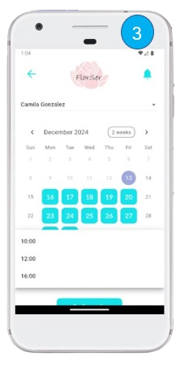
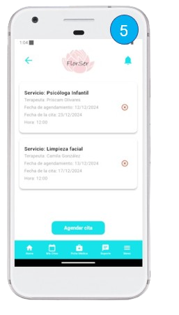
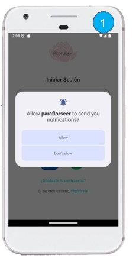

# FlorZen App
 

## Imagenes de la app en porceso de agendamiento

<p align="center">
  
  
  
  
  
  
</p>

## Imagenes de la app perfil de usuario

<p align="center">
  
  
  
  
  
  
</p>


## Imagenes de la app perfil de usuario administrador

<p align="center">
  
  
  
  
  
  
</p>

## Imagenes de la app perfil de usuario Terapeuta

<p align="center">
  
  
  
  
  
  
</p>
 
## Imagenes de la app notificaciones 

<p align="center">
  
  
  
  
  
  
</p>
 


## Descripción Breve
FlorZen App es una aplicación desarrollada para optimizar la gestión de terapias alternativas mediante:
- **Perfiles de usuario:** Incluye roles de administrador, usuario y terapeuta.
- **Módulo de agendamiento de citas:** Permite organizar terapias complementarias de manera eficiente.
- **Notificaciones:** Ofrece notificaciones locales y push (en desarrollo).

## Requisitos Previos
### Herramientas Necesarias
1. **Visual Studio Code:** Utilizado como editor de texto principal.
2. **Android Studio:** Necesario para generar emuladores y realizar pruebas en dispositivos Android.

### Lenguaje y Frameworks
- **Flutter:** Framework utilizado para el desarrollo.
- **Dart:** Lenguaje de programación base para la aplicación.

## Integración con Firebase
1. **Autenticación:** Se gestiona a través de Firebase para un acceso seguro.
2. **Base de datos:** Firebase se utiliza para el almacenamiento de datos en tiempo real.
3. **Mensajería y Notificaciones:** Implementación de notificaciones push (en desarrollo).

## Backend y Pruebas
- **Backend:** Levantado en Node.js para gestionar las notificaciones y otros servicios.
- **Pruebas:** Realizadas con Postman para verificar el envío de notificaciones y servicios relacionados.

## Pasos para Ejecutar la Aplicación
1. **Clonar el Repositorio**
   ```bash
   git clone <https://github.com/MARBEN2014/proyecto_florser_titulo>
   cd <proyecto_florser_titulo>
   ```
2. **Instalar Dependencias**
   ```bash
   flutter pub get
   ```
3. **Configurar Firebase**
   - Descargue los archivos `google-services.json` (para Android) y `GoogleService-Info.plist` (para iOS).
   - Coloque estos archivos en las carpetas respectivas de su proyecto (`android/app` y `ios/Runner`).

4. **Ejecutar la Aplicación en el Emulador**
   - Configure un emulador en Android Studio siguiendo las instrucciones del IDE.
   - Inicie la aplicación desde Visual Studio Code o Android Studio:
     ```bash
     flutter run
     ```

5. **Registrar y Navegar en la App FlorZen**
   - Abra la aplicación en el emulador o dispositivo físico.
   - Regístrese utilizando un correo electrónico válido.
   - Inicie sesión con las credenciales creadas.
   - Explore las funcionalidades disponibles: agendar citas, gestionar notificaciones y más.

   ## Recurso Adicional

Para obtener el instructivo y el archivo de instalación del APK siguiente enlace:  
-[Descarga el instructivo del APk, del siguiente enlace](https://drive.google.com/file/d/13mQx_J0BR-GJ9Q7jo51S9vtCiJUfbMoe/view?usp=sharing)

-[Descargar el archivo APK, del siguiente enlace](https://drive.google.com/file/d/1y3dQrblIfaLEwicr-CYi7EA5kG3Lu_HQ/view?usp=sharing )
